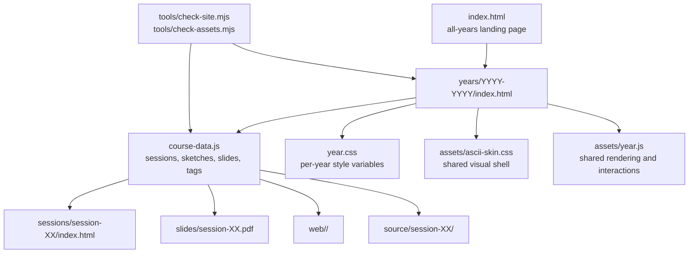

# Repository Architecture

This is a static GitHub Pages course archive. Each academic year is self-contained, while shared rendering and maintenance checks live at the repository root.

## Page Split

- `index.html` keeps page structure and teacher-facing editorial text.
- `course-data.js` is the source of truth for repeated course material: session cards, slide menus, sketch cards, search entries, tags, difficulty, duration, and related sketches.
- `assets/year.js` renders repeated components and handles search, slide switching, smooth anchor movement, accessible active navigation, and lazy sketch previews.
- `year.css` holds per-year style variables (a historical accent palette and route label). It does not set the rendered look: `assets/ascii-skin.css`, which every course page loads directly or through its stylesheet's `@import` and which takes precedence through `!important` rules, establishes the shared monochrome interface for all years (see [DESIGN.md](DESIGN.md)). Fix shared-interface problems in that shell rather than in year folders, so historical years stay untouched.

## Maintenance Rule

When adding a session, sketch, or slide, update `course-data.js` first. Then run `npm run check`; it validates links from the generated interface as well as links written directly in HTML.

Year landing pages use the same section order: current session, web sketches, Lab, Processing/p5.js comparison, slides, projects, and sessions. Keep that structure stable so each academic year feels like the same archive with different course content.
